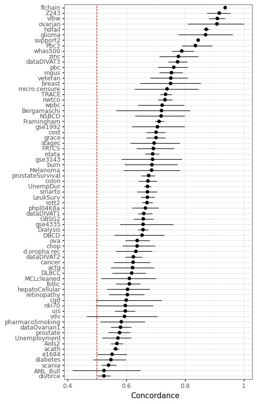

# SurvSet: An open-source time-to-event dataset respository

[`SurvSet`](https://arxiv.org/pdf/2203.03094.pdf) is the first ever open-source time-to-event dataset repository. The goal of `SurvSet` is to allow researchers and practioneeres to benchmark machine learning models and assess statistical methods. All datasets in this repository are consisently formatted to enable rapid prototyping and inference. The origins of this dataset were for testing regularity conditions of the [False Positive Control Lasso](https://arxiv.org/abs/1903.12584).

While `SurvSet` is designed for `python`, the formatted datasets can found in a comma-separated format within [this folder](https://github.com/ErikinBC/SurvSet/tree/main/SurvSet/_datagen/output). `SurvSet` currently has 76 datasets which vary in dimensionality (see figure below). This includes high-dimensional genomics datasets (p >> n) like `gse1992`, and long and skinny datasets like `hdfail` (n >> p). 

## Installation

`SurvSet` can be installed using `pip` for `python3`: `pip install SurvSet`. You can run `python3 -m SurvSet` to make sure the package has compiled without errors. Please note that `pandas` and `numpy` will be installed as dependencies (see [PyPI](https://pypi.org/project/SurvSet/) for more details).   

## Dataset structure and origin

Most of `SurvSet`'s datasets come from existing `R` packages. The accompanying [arXiv paper](https://arxiv.org/pdf/2203.03094.pdf) provides a full list of package sources and references. Datasets can be called in from the main class `SurvLoader` with the `load_dataset` method. This will return a `pandas` DataFrame with the following columns structure:

1. `pid`: the unique observation identifier (especially relevant for time-varying datasets)
2. `event`: a binary event indicator (1==event has happened) 
3. `time`: time to event/censoring (or start time if `time2` exists)
4. `time2`: end time [`time`, `time2`) if there are time-varying features
5. `num_{}`: prefix implies a continuous feature
6. `fac_{}`: prefix implies a categorical feature

Currently 7 datasets have time-varying features. Some datasets will have the same feature a both a continuous and categorical feature. This was done for those features that are plausibly ordinal.

### Figure: Dataset dimensionality


# Usage (simple)

Print the list of datasets that can be loaded and load the `ova` dataset.

```python
from SurvSet.data import SurvLoader
loader = SurvLoader()
# List of available datasets and meta-info
print(loader.df_ds.head())
# Load dataset and its reference
df, ref = loader.load_dataset(ds_name='ova').values()
print(df.head())
```

# Usage (complex)

The example below shows a simple machine learning pipeline that fits a series of ElasticNet CoxPH models to each of the (non-time-varying) datasets. To make run the code, please install the appropriate packages: `conda install -c bcg_gamma -c conda-forge scikit-learn=1.0.2 sklearndf=2.0 scikit-survival=0.17.0 plotnine=0.8.0`.


```python
import os
import numpy as np
import pandas as pd
import plotnine as pn
from SurvSet.data import SurvLoader
from sksurv.util import Surv
from sksurv.metrics import concordance_index_censored as concordance
from sksurv.linear_model import CoxnetSurvivalAnalysis
from sklearn.model_selection import train_test_split
from sklearn.compose import make_column_selector
from sklearndf.pipeline import PipelineDF
from sklearndf.transformation import OneHotEncoderDF, ColumnTransformerDF, SimpleImputerDF, StandardScalerDF

# (i) Set up feature transformer pipeline
enc_fac = PipelineDF(steps=[('ohe', OneHotEncoderDF(sparse=False, drop=None, handle_unknown='ignore'))])
sel_fac = make_column_selector(pattern='^fac\\_')
enc_num = PipelineDF(steps=[('impute', SimpleImputerDF(strategy='median')), ('scale', StandardScalerDF())])
sel_num = make_column_selector(pattern='^num\\_')
# Combine both
enc_df = ColumnTransformerDF(transformers=[('ohe', enc_fac, sel_fac),('s', enc_num, sel_num)])

# (ii) Run on datasets
alpha = 0.1
senc = Surv()
loader = SurvLoader()
ds_lst = loader.df_ds[~loader.df_ds['is_td']]['ds'].to_list()  # Remove datasets with time-varying covariates
n_ds = len(ds_lst)
holder_cindex = np.zeros([n_ds, 3])
for i, ds in enumerate(ds_lst):
    print('Dataset %s (%i of %i)' % (ds, i+1, n_ds))
    anno = loader.df_ds.query('ds == @ds').T.to_dict()
    anno = anno[list(anno)[0]]
    df, ref = loader.load_dataset(ds).values()
    # Random stratified split
    df_train, df_test = train_test_split(df, stratify=df['event'], random_state=1, test_size=0.3)
    # Fit encoder
    enc_df.fit(df_train)
    # Sanity check
    cn_prefix = enc_df.feature_names_original_.str.split('_',1,True)[0].unique()
    assert all([cn in ['fac', 'num'] for cn in cn_prefix])
    # Prepare numpy arrays
    X_train = enc_df.transform(df_train)
    So_train = senc.from_arrays(df_train['event'].astype(bool), df_train['time'])
    X_test = enc_df.transform(df_test)
    # Fit model
    mdl = CoxnetSurvivalAnalysis(normalize=True)
    mdl.fit(X=X_train, y=So_train)
    scores_test = mdl.predict(X_test)
    res_test = df_test[['event','time']].assign(scores=scores_test)
    So_test = senc.from_arrays(res_test['event'].astype(bool), res_test['time'])
    conc_test = concordance(So_test['event'], So_test['time'], res_test['scores'])[0]
    # Get concordance and 90% CI
    n_bs = 250
    holder_bs = np.zeros(n_bs)
    for j in range(n_bs):
        res_bs = res_test.groupby(['event']).sample(frac=1,replace=True,random_state=j)
        So_bs = senc.from_arrays(res_bs['event'].astype(bool), res_bs['time'])
        conc_bs = concordance(So_bs['event'], So_bs['time'], res_bs['scores'])[0]
        holder_bs[j] = conc_bs
    lb, ub = np.quantile(holder_bs, [alpha,1-alpha])
    holder_cindex[i] = [conc_test, lb, ub]

# (iii) Merge results & plot
df_cindex = pd.DataFrame(holder_cindex, columns=['cindex', 'lb', 'ub'])
df_cindex.insert(0, 'ds', ds_lst)
ds_ord = df_cindex.sort_values('cindex')['ds'].values
df_cindex['ds'] = pd.Categorical(df_cindex['ds'], ds_ord)

gg_cindex = (pn.ggplot(df_cindex, pn.aes(y='cindex',x='ds')) + 
    pn.theme_bw() + pn.coord_flip() + 
    pn.geom_point(size=2) + 
    pn.geom_linerange(pn.aes(ymin='lb', ymax='ub')) + 
    pn.labs(y='Concordance') + 
    pn.geom_hline(yintercept=0.5,linetype='--', color='red') + 
    pn.theme(axis_title_y=pn.element_blank()))
gg_cindex
```




## Adding new datasets

If you are interested in contributing to `SurvSet` or know of other open-source time-to-event datasets you think would be useful additions, please contact me. If you would like to see these datasets adopted quickly, please directly modify the data generating process found in `SurvSet/_datagen/pipeline.sh` and create a pull request. 

## How to cite

If you use `SurvSet` in your research or project please cite the following: 

```
@article{drysdale2022,
  title={{SurvSet}: An open-source time-to-event dataset repository},
  author={Drysdale, Erik},
  journal={arXiv preprint arXiv:2203.03094},
  year={2022}
}
```