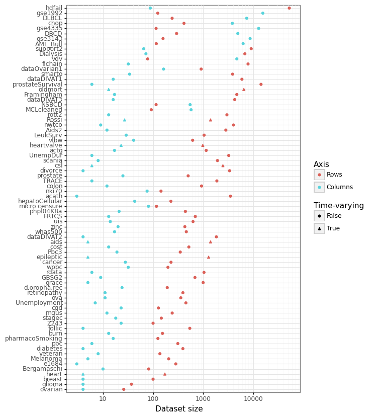

# SurvSet: An open-source time-to-event dataset respository

HOW DO I ADD HELP DOCUMENTATION?

[`SurvSet`]() is the first ever open-source time-to-event dataset repository. The goal of `SurvSet` is to allow researchers and practioneeres to benchmark machine learning models and assess statistical methods. All datasets in the repository are consisently formatted. This enables for rapid prototyping and assessment. The origins of this dataset were for testing regularity conditions of the [False Positive Control Lasso](https://arxiv.org/abs/1903.12584).

While `SurvSet` is designed for `python`, the formatted datasets can found in a comma-separated format within [this repo](https://github.com/ErikinBC/SurvSet/tree/main/SurvSet/_datagen/output). `SurvSet` currently has 76 datasets, which vary in dimensionality (see figure below). This includes high-dimensional genomics datasets ($p \gg n$) like `gse1992`, and long and skinny datasets like `hdfail`. Please see the [arXiv paper]() for a full list of package sources and references.

<center><h2><b>Figure: Dataset dimensionality </b></h2></center>
<center><p></p></center>

## Installation

`SurvSet` can be installed using `pip` for `python3`: `pip install SurvSet`. You can run `python3 -m SurvSet` to make sure the package has compiled without errors.

# Example usage

Show with sklearn+survival

```
import 
```


## Adding new datasets

If you are interested in contributed to `SurvSet` or know of other open-source time-to-event datasets you think would be useful additions, please contact me. If you would like to see these datasets adopted quickly, please directly modify the data generating process found in `SurvSet/_datagen/pipeline.sh` and create a pull request. 