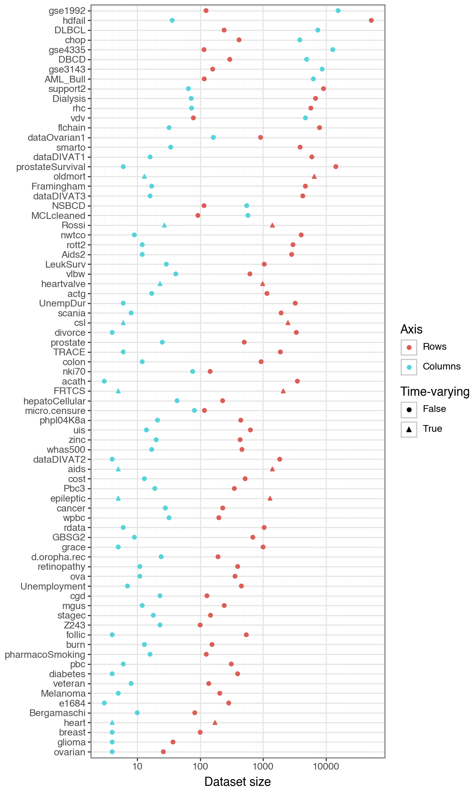

# SurvSet: An open-source time-to-event dataset respository

[`SurvSet`](https://arxiv.org/pdf/2203.03094.pdf) is the first ever open-source time-to-event dataset repository. The goal of `SurvSet` is to allow researchers and practioneeres to benchmark machine learning models and assess statistical methods. All datasets in this repository are consisently formatted to enable rapid prototyping and inference. The origins of this dataset were for testing regularity conditions of the [False Positive Control Lasso](https://arxiv.org/abs/1903.12584).

`SurvSet` currently has 77 datasets (8 of which are time-varying) which vary in dimensionality (see figure below). This includes high-dimensional genomics datasets (p >> n) like `gse1992`, and long and skinny datasets like `hdfail` (n >> p). 

See the [Changelog](CHANGELOG.md)

## Installation

`SurvSet` can be installed using `pip` for `python3`: `pip install SurvSet`. You can run `python3 -m SurvSet` to make sure the package has compiled without errors. Please note that `pandas` and `numpy` will be installed as dependencies (see [PyPI](https://pypi.org/project/SurvSet/) for more details).   

## Dataset structure and origin

Most of `SurvSet`'s datasets come from existing `R` packages. The accompanying [arXiv paper](https://arxiv.org/pdf/2203.03094.pdf) provides a full list of package sources and references. Datasets can be called in from the main class `SurvLoader` with the `load_dataset` method. This will return a `pandas` DataFrame with the following columns structure:

1. `pid`: the unique observation identifier (especially relevant for time-varying datasets)
2. `event`: a binary event indicator (1==event has happened) 
3. `time`: time to event/censoring (or start time if `time2` exists)
4. `time2`: end time [`time`, `time2`) if there are time-varying features
5. `num_{}`: prefix implies a continuous feature
6. `fac_{}`: prefix implies a categorical feature

Currently, 8 datasets have time-varying features. Some datasets will have the same feature a both a continuous and categorical feature. This was done for those features that are plausibly ordinal.

### Figure: Dataset dimensionality



# Usage (simple)

Print the list of datasets that can be loaded and load the `ova` dataset.

```python
from SurvSet.data import SurvLoader
loader = SurvLoader()
# List of available datasets and meta-info
print(loader.df_ds.head())
# Load dataset and its reference
df, ref = loader.load_dataset(ds_name='ova').values()
print(df.head())
```

# Usage (complex)

The example below shows a sketch of what a machine learning might look like using an ElasticNet CoxPH model to a non-time-varying dataset, and a traditional CoxPH to a time-varying one. 

```python
# Modules needed for fitting
import pandas as pd
from sksurv.util import Surv
from lifelines import CoxTimeVaryingFitter
from sksurv.linear_model import CoxnetSurvivalAnalysis
from sklearn.pipeline import Pipeline
from sklearn.impute import SimpleImputer
from sklearn.preprocessing import OneHotEncoder, StandardScaler
from sklearn.compose import make_column_selector, ColumnTransformer
# Set up the dataset loader
from SurvSet.data import SurvLoader
loader = SurvLoader()

# (i) Set up a pipeline to handle numerical (possibly missing) and categorical features 
enc_fac = Pipeline(steps=[('ohe', OneHotEncoder(drop=None,sparse_output=False, handle_unknown='ignore'))])
sel_fac = make_column_selector(pattern='^fac\\_')
enc_num = Pipeline(steps=[('impute', SimpleImputer(strategy='median')), 
                        ('scale', StandardScaler())])
sel_num = make_column_selector(pattern='^num\\_')
enc_df = ColumnTransformer(transformers=[('ohe', enc_fac, sel_fac),('s', enc_num, sel_num)])
enc_df.set_output(transform='pandas')

# (ii) Non-time-varying dataset (prostate)
df_prostate = loader.load_dataset(ds_name='prostate')['df']
# Set up data and model
senc = Surv()
So = senc.from_arrays(df_prostate['event'].astype(bool), df_prostate['time'])
enc_df.fit(df_prostate)
X_train = enc_df.transform(df_prostate)
mdl = CoxnetSurvivalAnalysis(n_alphas=50, )
# Fit and predict
mdl.fit(X=X_train, y=So)
mdl.predict(X_train)

# (ii) Load a time-varying dataset (epileptic)
df_epileptic = loader.load_dataset(ds_name='epileptic')['df']
# Set up data and model
mdl = CoxTimeVaryingFitter(penalizer=0.1)
enc_df.fit(df_epileptic)
X_train = enc_df.transform(df_epileptic)
X_train = pd.concat(objs=[df_epileptic[['pid','event','time','time2']], X_train], axis=1)

# Fit and predict
mdl.fit(X_train, id_col="pid", event_col="event", start_col="time", stop_col="time2", show_progress=False)
# Get test prediction
mdl.predict_partial_hazard(X_train)
```

See the [simulation](simulation/__main__.py) script for how to generate test-set concordance-index scores, which are highlighted below.


## Making changes to the package

If you are interested in contributing to `SurvSet` or know of other open-source time-to-event datasets you think would be useful additions, feel free to make a fork of the repo or a PR.

### Environment set up

You can start by creating a virtual environment to align with the development environment.

1. `python -m venv surv`
2. `pip install -r requirements.txt`
3. `source surv/bin/activate`

### How to add a new package/dataset

The SurvSet._datagen module will generate the underlying raw data and process it. There are currently two ways to add a dataset:

1. SurvSet/_datagen/download_pkgs.py: Will leverage existing R packages, which you can add to the `di_pkgs` dictionary in the SurvSet/_datagen/utils/funs_pkgs.py file (these will be stored locally in the ..utils/pkgs folder).
2. For all others, they are manually describe in the SurvSet/_datagen/download_custom file.py and stored in the ..utils/custom folder.

After the file download script is completed, a class will need to added to the datasets.py file in either the Rprocess or Cprocess folders. See the existing examples to align the required method/class structure (should be intuitive). Next, in the corresponding __init__.py file for R/CProcess, add your new class and corresponding methods/file-names. This will be called in by the process_datasets.py script to write a new pickle file. 


## How to cite

If you use `SurvSet` in your research or project please cite the following: 

```
@article{drysdale2022,
  title={{SurvSet}: An open-source time-to-event dataset repository},
  author={Drysdale, Erik},
  journal={arXiv preprint arXiv:2203.03094},
  year={2022}
}
```